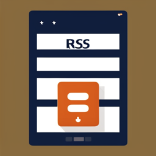

# RSStoKindle
A simple way to convert RSS feeds into pdfs and use the kindle email address to forward them to your kindle.
## Requirments
- Python 3.7+
- Kindle 
- A list of rss feeds

## Prerequisits 
You need to first white list the email address you kindle will receive from. This can be done my accessing your amazon settings.
Head to *YourAcount -> Content and Devices -> Preferences -> Personal Document Settings 

## Configuration

Edit the config.ini file to include your:
- kindle email address
- Email address you will be sending from
- Email password
- STMP server
- Feed list 

# Creating a cron job

To create a daily cron job to send your feeds to your kindle run the following command:
```bash
crontab -e
```
Then add the following line to the end of the file:
```bash
6 0 * * * python3 /path/to/RSStoKindle/kindle.py
```
This will run the script every day at 6AM (change according to your preferences).


### ToDo
- [ ] Add support for multiple kindle email addresses
- [ ] Fix issue with some feeds containing non-utf8 characters no compiling correctly
- [ ] add image compression
